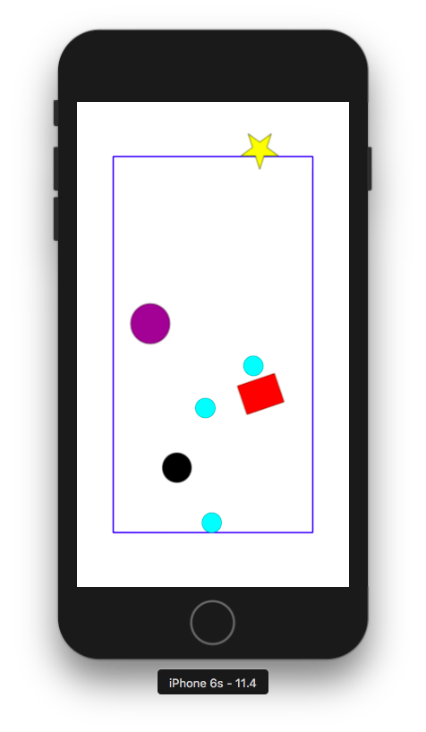

# Basic PhysicsBodies Demo

A small RubyMotion app for iOS exploring Sprike Kit's SKSpriteNode with SKPhysicsBody.

Build and run in the iOS simulator with `rake` from the project directory

# Scenes and hot corners

The app has three scenes and hot corners for switching among them:

* `EdgeRunnerScene` (red background), has bounds, marker and hole. Touch in the bottom-right corner to switch to `TallyScene`.
* `TallyScene` (white background), combines all the `EdgeRunnerScene` and `DragWithPhysicsScene` elements. Touch in the bottom-left corner to switch to `EdgeRunnerScene` or bottom-right corner to switch to `DragWithPhysicsScene`.
* DragWithPhysicsScene (orange background), has bounds, purple circle and red rect. Touch in the bottom-left corner to switch to `TallyScene`.

The app begins in `TallyScene`. Scenes are reset when switched. Looks like:

  

# Sprites

Blue bounds

* large, blue rectangle with edge body
* contains cyan balls and has gravity in the direction away from marker
* when gravity is to the left (marker to the right), the left edge turns to a dashed green line and cyan balls fall through

Cyan ball 

* is spawned at a non-dragging touch on marker (or within bounds, in the DragWithPhysicsScene)
* collides with everything except other cyan balls

Marker

* can be dragged around the bounds edge, but nowhere else
* indicates the direction of gravity and where cyan balls will fall from.

Black hole

* static obstacle
* swallows cyan balls that cross it

Red rect

* moveable obstacle, can be dragged and dropped anywhere
* while being dragged, it can move cyan balls like a paddle
* spins when it hits things while it's being dragged; once dropped, others can't move it but it rotates to follow any touch. Or drag, rather. It won't bother with a simple touch, so that it's possible to set the rect orientation and then drop a cyan ball toward it.

Purple circle

* moveable obstacle, can be dragged and dropped anywhere
* while being dragged, it can move cyan balls like a paddle

# Notes

* Apple docs say SKConstraint can't be changed once made (ie immutable), so they suggest enabling/disabling. But you _can_ set/reset self.constraints property to different arrays of SKContraints.
* to get the size for a simple rectangle or circle physics body of a sprite whose texture has whitespace/alpha around it, take it into Preview and fit a rectangular selection around it -- a pop up shows the current selection dimensions.
* Need to make a proper investigation of subclassing, in Ruby, in RubyMotion and of SDK classes. For now: don't expect it to work like Java! Check whether methods need to call super. Accessing superclass properties may need 'self.' rather than '@' (or not. But something to play with if you get stuck).
* The hole effect isn't convincing. In particular, the ball doesn't move to the hole's centre and shrink. Nice to try giving the hole some gravity. 

### Drag-and-drop with physics bodies

Moving a sprite with a volume-based physics body by setting it's `position` or running a `moveTo` SKAction is sketchy. Generally, the sprite will move but the timing gets messed up. Better to move a physics sprite with physics methods.

In the app, the moveable obstactles purple circle and red rect have physics bodies so they'll block the cyan balls. For drag-and-drop, we need to keep track of which we touch and where in touchesBegan and touchesMoved, then apply the difference when touchesEnded. 

To move an obstacle sprite that has a physics body, that sprite needs:

* `sprite.physicsbody.dynamic = true`
* `sprite.physicsbody.velocity =` a vector of the force to be applied x, y.
* [possibly `sprite.physicsbody.affectedByGravity = false`, if that would noticeably change the velocity effect? FIXME!!!]

In this app, when an obstacle is not being moved, we need
* `sprite.physicsbody.dynamic = false`, so it will block (also makes `affectedByGravity` irrelevant)

### Faux left gateway demo

As currently implemented, that the left boundary is porous, so that balls pass through when the gravity source shifts to the left (opposite the marker on the right) is an illusion -- actually, we're just turning off collisions for the whole boundary rectangle. Tricky but possible to demo: put the edge runner at the top, very near the right edge, and release a cyan ball. Move the edge runner to the right edge just before the ball lands (not letting the ball bounce) and its momentum will carry it down through the bottom boundary.

Better would be to make the left boundary beyond the edge of the screen (at least as far as the thickest sprite to fall through), make the dash_layer blocking and the edge runner follow the composed rectangle we see (walled solid, solid, solid, dash). Can't be bothered right now.

# Sources

* Apple docs (Obj-C) [class SKPhysicsBody](https://developer.apple.com/documentation/spritekit/skphysicsbody?language=objc) and pages linked to.
* Stackoverflow post [SKNode follow another SKNode within SKConstraint bounds](https://stackoverflow.com/questions/40850937/sknode-follow-another-sknode-within-skconstraint-bounds) for having the red rect track the touch.
* Github repl [aytek/SpriteKitDrag](https://github.com/aytek/SpriteKitDrag) drag-and-drop of sprites with physics bodies by setting the velocity property to a vector in #update.
* DezBlog post [SpriteKit with Swift: Orienting Sprites to a Location](https://dezwitter.wordpress.com/2015/02/05/spritekit-with-swift-orienting-sprites-to-a-location/) rotating sprites with SKActions. How not to do it when they have physics bodies.
